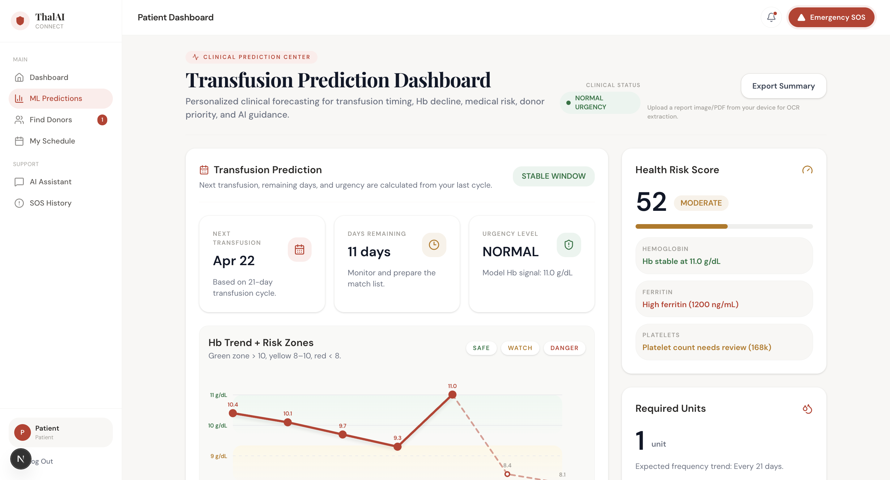
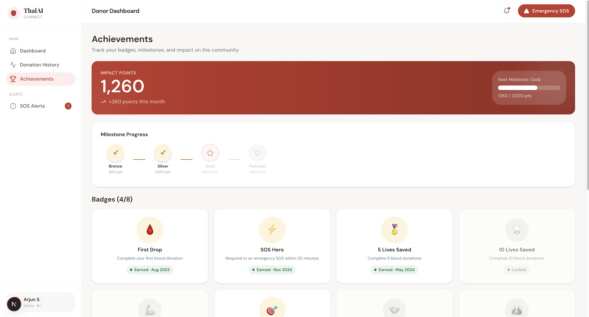
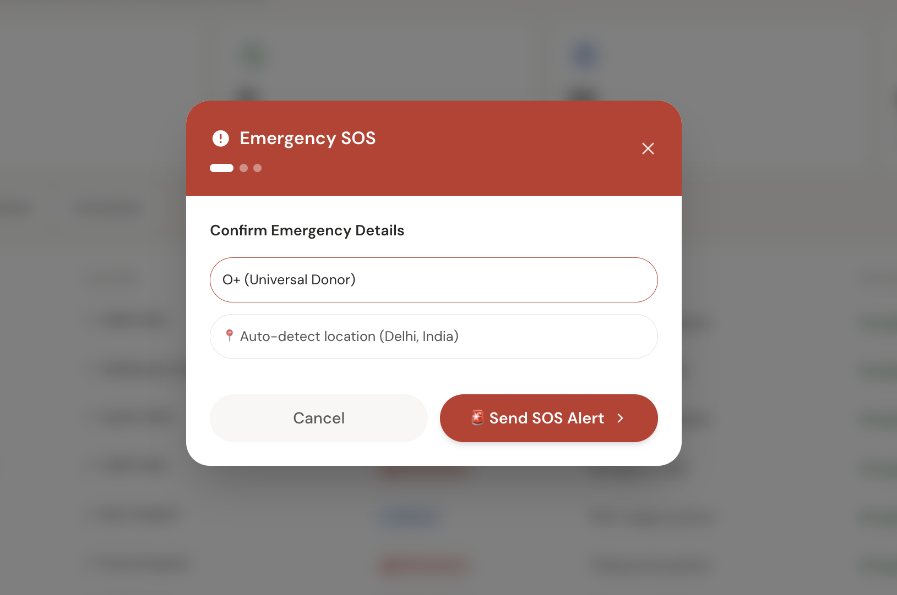

# 🩸 ThalAI Connect

> **Find. Predict. Respond.**
> A real-time AI-powered platform for thalassemia patients and blood donors.

<br>

🔗 **Live Demo:** *(Add your deployed link here)*
📂 **Repository:** https://github.com/yugankfatehpuria4/ThaIConnect

---

## 🎯 Overview

**ThalAI Connect** is a full-stack healthcare application that helps thalassemia patients **find blood donors instantly**, track their health trends, and respond to emergencies in real time.

The system combines **real-time communication (Socket.io)**, **machine learning predictions**, and **AI assistance** to improve the speed and reliability of blood donation.

---

## 🌟 Key Features

* 🚨 **Real-Time SOS System**
  Instantly notify nearby donors using WebSockets during emergencies.

* 🤝 **Smart Donor Matching**
  Matches donors based on blood group, location, availability, and activity.

* 📊 **ML-Based Health Insights**
  Predicts hemoglobin trends and estimates transfusion needs using clinical data.

* 💬 **AI Assistant**
  Provides basic guidance, awareness, and answers to patient queries.

* 📈 **Donation & Health Tracking**
  Patients track transfusion history; donors track contribution and impact.

* 🧑⚕️ **Multi-Role Dashboards**
  Separate dashboards for Patients, Donors, and Admins.

---

## 🛠️ Tech Stack

| Tech                   | Description             |
| ---------------------- | ----------------------- |
| Next.js (React)        | Frontend framework      |
| Tailwind CSS           | UI styling              |
| Node.js + Express      | Backend API             |
| MongoDB + Mongoose     | Database                |
| Socket.io              | Real-time communication |
| Python + Flask         | ML service              |
| Scikit-learn / XGBoost | Prediction models       |

---

## 📸 Screenshots

> Add your screenshots inside `public/` or `assets/` folder

| Patient Dashboard       | Donor Dashboard       | SOS System          |
| ----------------------- | --------------------- | ------------------- |
|  |  |  |

---

## 🚀 Setup & Installation

### 🔧 Prerequisites

* Node.js (v18+)
* Python (v3.9+)
* MongoDB (Atlas recommended)

---

### ⚙️ Local Installation

```bash
git clone https://github.com/yugankfatehpuria4/ThaIConnect.git
cd ThalAI-Connect
```

---

### ▶️ Backend Setup

```bash
cd backend
npm install
npm run dev
```

---

### 🤖 ML Service Setup

```bash
cd ai-service
python -m venv .venv

# Mac/Linux
source .venv/bin/activate
# Windows
# .venv\Scripts\activate

pip install -r requirements.txt
python app.py
```

---

### 🌐 Frontend Setup

```bash
cd frontend
npm install
npm run dev
```

Open: `http://localhost:3010`

---

## 💡 Usage Guide

1. **Register as Patient / Donor / Admin**
2. As a **Patient**:

   * Search for donors
   * Track health metrics
   * Trigger SOS alerts
3. As a **Donor**:

   * Receive real-time SOS alerts
   * Accept/reject requests
   * Track donation history
4. As an **Admin**:

   * Monitor system activity
   * Manage users and requests

---

## 📁 Folder Structure

```
ThaIConnect/
├── backend/        # Express server + APIs
├── frontend/       # Next.js app
├── ai-service/     # Flask ML service
├── ml-data/        # Datasets
├── models/         # Saved ML models
└── README.md
```

---

## 🗺️ Future Roadmap

* 📍 Google Maps-based donor tracking
* 📲 WhatsApp/SMS SOS alerts
* 📄 Medical report upload & analysis (OCR)
* 🧠 Advanced ML (time-series prediction)
* ☁️ Cloud deployment (AWS / Vercel / Railway)

---

## 🤝 Author

Built with ❤️ by **Yugank Fatehpuria**

---
